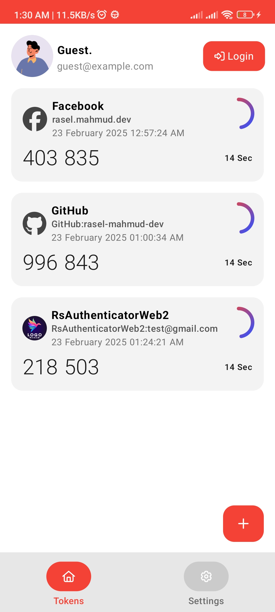

Here's your **enhanced and well-structured README** by merging and rearranging the previous versions:


# RS Authenticator – Secure & Offline 2FA App

[](https://github.com/rasel-mahmud-dev/rs-authenticator-app/releases)

RS Authenticator is a **secure and feature-rich authentication app** that allows users to generate **Time-Based One-Time Passwords (TOTP)**, manage authentication codes, and ensure app security with and PIN-based unlocking**. Built using **Kotlin Jetpack Compose**, it offers **100% offline functionality** without tracking user data.

---

## 🚀 Features

- **🔐 App Security:** Unlock/Lock using **PIN or Biometrics**.
- **🕒 Authenticator Code Generation:** Supports **TOTP-based 2FA authentication**.
- **📸 QR Code Scanning:** Easily **scan QR codes** to add authentication accounts.
- **🗄️ Offline Data Storage:** Securely stores authentication data **locally** using **SQLite**.
- **📂 Backup & Restore:** Securely export/import your authentication codes.
- **⚡ Multiple Algorithm Support:** Supports **SHA1, SHA256, and SHA512** for generating TOTP codes.

---

## 📸 Screenshots



---

## 🏗️ Built With

- **Language:** Kotlin
- **Framework:** Jetpack Compose
- **Database:** SQLite
- **Authentication:** Offline (No tracking, no internet required)
- **Navigation:** Jetpack Navigation
- **UI Components:** Material 3 + Custom Components

---

## 📲 How to Set Up MFA with RS Authenticator

1. **Download & Install**: Get RS Authenticator from the [Download Page](https://github.com/rasel-mahmud-dev/rs-authenticator-app/releases).
2. **Scan QR Code**: Open the app, tap **Add Account**, and scan the MFA QR code from your service provider.
3. **Generate Codes**: RS Authenticator will generate a **6-digit TOTP code** that refreshes every 30 seconds.
4. **Secure Your App**: Enable **App Lock** (PIN/Biometric) for added security.
5. **Backup Your Accounts**: Export your data securely to restore later.

---

## 🛠️ Installation Guide

### Prerequisites
- Android Studio (Latest Version)
- Kotlin & Jetpack Compose Support

### Clone the Repository
```sh
git clone https://github.com/rasel-mahmud-dev/rs-authenticator-app.git
cd rs-authenticator-app
```

### Open in Android Studio
1. Open **Android Studio**.
2. Click **Open an existing project**.
3. Select the **rs-authenticator-app** folder.
4. Wait for Gradle to sync dependencies.

### Build & Run
- Connect a physical device or start an emulator.
- Click on **Run ▶️** to launch the app.

---

## 📜 Usage Guide

- **Login/Register** to start using the app.
- **Scan QR Codes** to add 2FA accounts.
- **View Generated OTPs** securely within the app.
- **Enable App Lock** for additional security.

---

## 📂 Project Structure

### 📺 Screens
```
screens/
 ├── AboutScreen.kt
 ├── AppsScreen.kt
 ├── BackupRestore.kt
 ├── ConnectAppScreen.kt
 ├── FeaturesScreen.kt
 ├── ForgotPasswordScreen.kt
 ├── HomeScreen.kt
 ├── LoginScreen.kt
 ├── ProfileScreen.kt
 ├── RegistrationScreen.kt
 ├── ScanQRCodeScreen.kt
 ├── SecurityScreen.kt
 ├── TokenScreen.kt
 ├── TourScreen.kt
 ├── TrashScreen.kt
```

### 🏗️ Components
```
components/
 ├── form/
 ├── security/
 ├── settings/
 ├── AuthenticatorItem.kt
 ├── BottomSheet.kt
 ├── CustomText.kt
 ├── GradientCircularProgressIndicator.kt
 ├── HomeBottomNav.kt
 ├── MainSidebar.kt
 ├── PrimaryButton.kt
 ├── ProtectedRoute.kt
 ├── RsColumn.kt
 ├── RsIconButton.kt
 ├── RsRow.kt
 ├── ScreenHeader.kt
 ├── Toast.kt
 ├── UnlockWrapperScreen.kt
```

### 🔧 Core Modules
```
rsauthenticator/
 ├── apis/
 ├── components/
 ├── database/
 ├── dto/
 ├── http/
 ├── layout/
 ├── screens/
 ├── state/
 ├── theme/
 ├── utils/
 ├── AppNavigation.kt
 ├── MainActivity.kt
```

---

## 🚀 Contributing

We welcome contributions! If you’d like to improve the project:

1. **Fork the repository**.
2. **Create a feature branch** (`git checkout -b feature-name`).
3. **Commit changes** (`git commit -m "Add new feature"`).
4. **Push to your fork** (`git push origin feature-name`).
5. **Open a pull request**.

---

## 📞 Contact

For any queries, reach out to **[Rasel Mahmud](https://www.linkedin.com/in/rasel-mahmud-dev)**.

